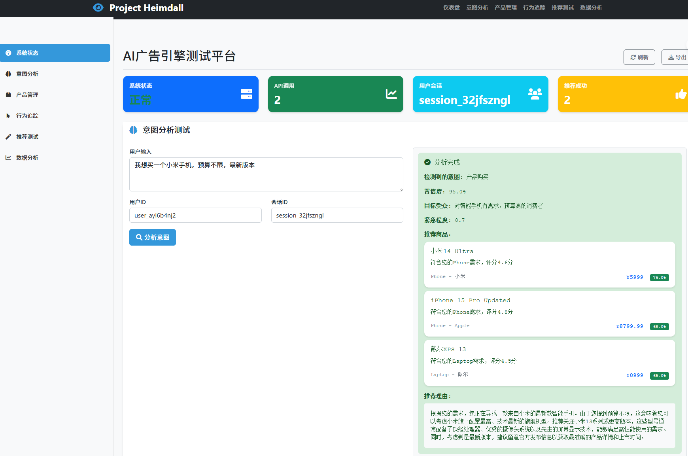
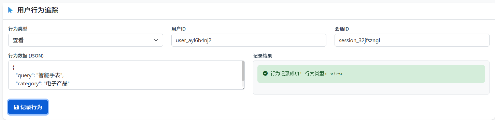
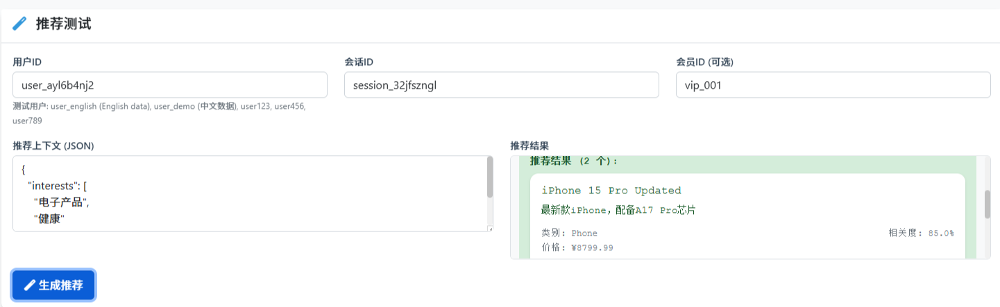
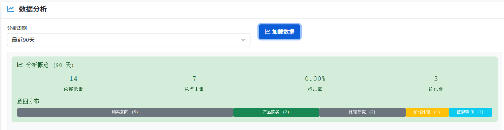

# 业务逻辑

## 业务概述

Project Heimdall 是一个企业级AI意图广告引擎，核心业务是通过AI技术分析用户意图，提供精准的广告推荐服务。系统主要包含四大核心业务模块：意图分析、用户画像、广告推荐和数据分析。

## 核心业务流程

### 1. 用户意图分析流程



#### 业务目标
- 准确识别用户的购买意图和需求
- 提取用户的关键信息（产品类型、预算、品牌偏好等）
- 评估用户的购买意愿强度和紧急程度

#### 流程步骤
```
用户输入 → 预处理 → LLM分析 → 意图分类 → 实体提取 → 置信度评估 → 结果存储
```

#### 详细业务逻辑
1. **输入预处理**
   - 文本清洗和标准化
   - 敏感信息过滤
   - 语言检测和处理

2. **LLM意图分析**
   - 调用Qwen/通义千问模型
   - 使用提示词工程优化分析结果
   - 多轮对话上下文理解

3. **意图分类**
   - 购买意图（product_purchase）
   - 信息查询（information_search）
   - 比较分析（comparison）
   - 推荐请求（recommendation_request）

4. **实体提取**
   - 产品名称和类别
   - 价格预算范围
   - 品牌偏好
   - 使用场景和需求特征

5. **置信度评估**
   - 意图明确度评分（0.0-1.0）
   - 信息完整度评估
   - 购买意愿强度判断

#### 业务规则
- 置信度低于0.7时，要求用户澄清需求
- 缺少关键信息时，主动询问补充
- 多个意图并存时，按优先级排序

### 2. 用户画像构建流程



#### 业务目标
- 基于用户行为和历史数据构建精准用户画像
- 支持实时更新用户偏好和特征
- 为个性化推荐提供数据基础

#### 流程步骤
```
行为收集 → 特征提取 → 画像更新 → 分群归类 → 偏好预测 → 实时更新
```

#### 详细业务逻辑
1. **行为数据收集**
   - 浏览行为（产品查看、页面停留时间）
   - 搜索行为（搜索关键词、筛选条件）
   - 点击行为（广告点击、产品点击）
   - 购买行为（加入购物车、完成购买）

2. **特征提取**
   - 兴趣偏好（产品类别、品牌偏好）
   - 消费能力（价格区间、购买频次）
   - 行为模式（活跃时间、使用习惯）
   - 生命周期阶段（新用户、活跃用户、流失风险）

3. **用户分群**
   - 基于RFM模型的价值分群
   - 基于兴趣偏好的行为分群
   - 基于消费能力的层级分群

4. **画像更新策略**
   - 实时更新：最新行为立即反映
   - 批量更新：定期聚合分析历史数据
   - 衰减算法：老行为权重逐渐降低

#### 业务规则
- 新用户：基于初始行为快速建立基础画像
- 活跃用户：持续优化画像精度
- 静止用户：保留历史画像，降低更新频率

### 3. 广告推荐流程



#### 业务目标
- 基于用户意图和画像提供精准广告推荐
- 优化广告点击率和转化率
- 平衡商业价值和用户体验

#### 流程步骤
```
需求理解 → 候选筛选 → 相关性计算 → 排序优化 → 多样性处理 → 结果返回
```

#### 详细业务逻辑
1. **候选广告筛选**
   - 基于用户意图匹配相关广告
   - 基于用户画像过滤不相关广告
   - 考虑广告主预算和投放策略

2. **相关性计算**
   - 内容相关性（产品匹配度）
   - 用户相关性（画像匹配度）
   - 上下文相关性（当前场景匹配度）
   - 时间相关性（时效性匹配度）

3. **排序算法**
   - 综合评分 = α×相关度 + β×点击率 + γ×转化率 + δ×出价
   - 业务规则干预（新品加权、库存清理加权）
   - 多样性保证（避免同类型广告过度集中）

4. **推荐策略**
   - 意图明确时：直接匹配相关广告
   - 意图模糊时：基于画像推荐兴趣相关广告
   - 探索模式：适当推荐新广告以收集数据

#### 业务规则
- 每次推荐不超过5个广告
- 同一广告主广告不超过2个
- 新广告有初始曝光权重加成
- 低点击率广告逐步降低权重

### 4. 数据分析流程



#### 业务目标
- 提供全面的业务数据分析报表
- 监控系统性能和业务指标
- 支持决策优化和效果评估

#### 流程步骤
```
数据收集 → 数据清洗 → 指标计算 → 聚合分析 → 可视化展示 → 报表生成
```

#### 详细业务逻辑
1. **核心业务指标**
   - 意图分析准确率
   - 广告点击率（CTR）
   - 广告转化率（CVR）
   - 用户参与度指标

2. **用户行为分析**
   - 行为路径分析
   - 转化漏斗分析
   - 留存率分析
   - 生命周期价值分析

3. **广告效果分析**
   - ROI分析
   - A/B测试分析
   - 创意效果分析
   - 投放策略优化

4. **实时监控**
   - 系统性能监控
   - 业务异常检测
   - 实时告警机制

## 关键业务规则

### 1. 意图分析规则
- **明确意图优先**：用户表达明确需求时，优先满足直接需求
- **渐进式澄清**：信息不完整时，逐步引导用户补充
- **多意图处理**：支持同时识别多个意图，按优先级排序
- **上下文理解**：考虑对话历史和用户当前场景

### 2. 用户隐私保护规则
- **数据脱敏**：敏感信息在存储和分析时进行脱敏处理
- **用户授权**：用户数据使用需获得明确授权
- **数据生命周期**：遵循数据保留和删除策略
- **访问控制**：严格的数据访问权限控制

### 3. 广告推荐规则
- **相关性优先**：推荐内容必须与用户需求高度相关
- **用户体验**：避免过度商业化，保持内容价值
- **公平竞争**：不同广告主有公平的展示机会
- **透明度**：明确标识广告内容，不误导用户

### 4. 系统性能规则
- **响应时间**：API响应时间不超过500ms
- **可用性**：系统可用性不低于99.9%
- **数据一致性**：确保数据同步和一致性
- **容错能力**：单点故障不影响整体服务

## 异常处理逻辑

### 1. 意图分析异常
- **模型调用失败**：降级到规则匹配，记录错误日志
- **结果置信度过低**：要求用户澄清，提供引导选项
- **输入异常**：友好提示，引导正确输入格式

### 2. 推荐系统异常
- **无合适推荐**：返回通用推荐，记录异常情况
- **排序算法异常**：使用备用排序策略
- **数据源异常**：使用缓存数据，标记数据状态

### 3. 系统异常
- **数据库异常**：启用只读模式，保证基本功能
- **外部服务异常**：降级处理，使用本地缓存
- **性能异常**：启用限流措施，优先保证核心功能

## 业务优化策略

### 1. 算法优化
- **A/B测试**：持续测试和优化算法效果
- **模型更新**：定期更新AI模型提升准确性
- **特征工程**：不断优化特征提取和组合

### 2. 用户体验优化
- **个性化**：基于用户行为持续优化个性化体验
- **实时反馈**：根据用户反馈调整推荐策略
- **界面优化**：基于用户行为数据优化界面设计

### 3. 业务扩展
- **新功能引入**：基于业务需求逐步引入新功能
- **新场景支持**：扩展到更多业务场景和应用领域
- **合作伙伴**：与更多广告主和数据源合作

## 监控和评估

### 1. 业务指标监控
- **核心指标**：CTR、CVR、ROI等关键业务指标
- **用户指标**：用户满意度、留存率、活跃度
- **系统指标**：响应时间、可用性、错误率

### 2. 效果评估
- **定期评估**：月度业务效果评估和优化
- **专项分析**：针对特定问题进行深入分析
- **竞品分析**：与行业标准和竞品对比分析

### 3. 持续改进
- **数据驱动**：基于数据分析结果驱动业务改进
- **用户反馈**：收集和分析用户反馈意见
- **技术创新**：跟踪和应用最新技术发展