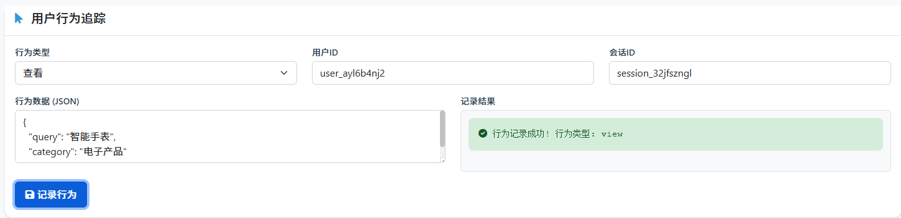

# 项目架构

## 项目概述

Project Heimdall 是一个企业级AI意图广告引擎，基于FastAPI构建，专注于通过AI技术分析用户意图并提供精准的广告推荐服务。

## 系统架构图

```
┌─────────────────────────────────────────────────────────────────┐
│                        前端展示层                                │
│  ┌─────────────┐  ┌─────────────┐  ┌─────────────┐            │
│  │  分析意图    │  │  数据分析    │  │  推荐产品    │            │
│  │  页面模块    │  │  页面模块    │  │  页面模块    │            │
│  └─────────────┘  └─────────────┘  └─────────────┘            │
└─────────────────────────────────────────────────────────────────┘
                                │
┌─────────────────────────────────────────────────────────────────┐
│                        API层 (FastAPI)                          │
│  ┌─────────────────────────────────────────────────────────────┐ │
│  │                   路由控制器                                │ │
│  │  ┌─────────────┐  ┌─────────────┐  ┌─────────────┐        │ │
│  │  │ 意图分析API  │  │ 用户行为API  │  │ 广告推荐API  │        │ │
│  │  └─────────────┘  └─────────────┘  └─────────────┘        │ │
│  └─────────────────────────────────────────────────────────────┘ │
└─────────────────────────────────────────────────────────────────┘
                                │
┌─────────────────────────────────────────────────────────────────┐
│                        业务逻辑层                                │
│  ┌─────────────────────────────────────────────────────────────┐ │
│  │                   核心服务                                  │ │
│  │  ┌─────────────┐  ┌─────────────┐  ┌─────────────┐        │ │
│  │  │ 意图分析服务 │  │ 用户画像服务 │  │ 推荐算法服务 │        │ │
│  │  └─────────────┘  └─────────────┘  └─────────────┘        │ │
│  │                                                         │ │
│  │  ┌─────────────┐  ┌─────────────┐  ┌─────────────┐        │ │
│  │  │ LLM集成服务 │  │ 会话管理服务 │  │ 数据分析服务 │        │ │
│  │  └─────────────┘  └─────────────┘  └─────────────┘        │ │
│  └─────────────────────────────────────────────────────────────┘ │
└─────────────────────────────────────────────────────────────────┘
                                │
┌─────────────────────────────────────────────────────────────────┐
│                        工具系统层                                │
│  ┌─────────────────────────────────────────────────────────────┐ │
│  │                   工具注册表                                │ │
│  │  ┌─────────────┐  ┌─────────────┐  ┌─────────────┐        │ │
│  │  │ 通用工具    │  │ 广告工具    │  │ 分析工具    │        │ │
│  │  │ (时间/天气) │  │ (推荐/匹配) │  │ (统计/报表) │        │ │
│  │  └─────────────┘  └─────────────┘  └─────────────┘        │ │
│  └─────────────────────────────────────────────────────────────┘ │
└─────────────────────────────────────────────────────────────────┘
                                │
┌─────────────────────────────────────────────────────────────────┐
│                        数据持久层                                │
│  ┌─────────────────────────────────────────────────────────────┐ │
│  │                   PostgreSQL数据库                          │ │
│  │  ┌─────────────┐  ┌─────────────┐  ┌─────────────┐        │ │
│  │  │ 用户数据    │  │ 行为数据    │  │ 广告数据    │        │ │
│  │  └─────────────┘  └─────────────┘  └─────────────┘        │ │
│  │                                                         │ │
│  │  ┌─────────────┐  ┌─────────────┐  ┌─────────────┐        │ │
│  │  │ 会话数据    │  │ 意图数据    │  │ 推荐数据    │        │ │
│  │  └─────────────┘  └─────────────┘  └─────────────┘        │ │
│  └─────────────────────────────────────────────────────────────┘ │
└─────────────────────────────────────────────────────────────────┘
```

## 核心组件架构

### 1. API层架构 (`src/heimdall/api/`)

```
api/
├── endpoints/
│   ├── testing/          # 测试相关接口
│   ├── intent_analysis/  # 意图分析接口
│   ├── advertising/      # 广告推荐接口
│   ├── analytics/        # 数据分析接口
│   └── tools/           # 工具调用接口
├── middleware/          # 中间件
├── dependencies/        # 依赖注入
└── __init__.py
```

**主要职责：**
- 接收HTTP请求并验证参数
- 调用业务逻辑层处理请求
- 返回标准化响应格式
- 处理错误和异常情况

### 2. 核心基础设施层 (`src/heimdall/core/`)

```
core/
├── database/           # 数据库连接和ORM配置
├── config/            # 配置管理
├── security/          # 安全中间件
├── logging/           # 日志系统
├── monitoring/        # 监控和指标
└── errors/           # 错误处理
```

**主要职责：**
- 提供数据库连接和ORM支持
- 管理应用配置和环境变量
- 处理认证、授权和安全防护
- 提供结构化日志记录
- 收集性能指标和健康检查

### 3. 业务逻辑层 (`src/heimdall/services/`)

```
services/
├── intent_analysis/   # 意图分析服务
├── user_profiling/    # 用户画像服务
├── recommendation/    # 推荐算法服务
├── advertising/       # 广告管理服务
├── session_management/ # 会话管理服务
└── analytics/         # 数据分析服务
```

**主要职责：**
- 实现核心业务逻辑
- 集成AI模型和算法
- 处理数据转换和计算
- 提供业务规则验证

### 4. 工具系统层 (`src/heimdall/tools/`)

```
tools/
├── registry.py        # 工具注册表
├── general/          # 通用工具
│   ├── datetime.py   # 时间处理
│   ├── weather.py    # 天气查询
│   └── math.py       # 数学计算
├── advertising/      # 广告相关工具
└── analytics/        # 分析工具
```

**主要职责：**
- 提供可复用的工具函数
- 支持动态工具注册和调用
- 封装外部API和第三方服务

## 数据流架构

### 1. 用户意图分析流程
```
用户输入 → API接收 → 意图分析服务 → LLM模型 → 意图识别 → 结果存储 → 返回响应
```

### 2. 广告推荐流程
```
用户行为 → 行为分析 → 用户画像 → 推荐算法 → 广告匹配 → 排序算法 → 推荐结果 → 展示广告
```

### 3. 数据分析流程
```
原始数据 → 数据清洗 → 特征提取 → 统计分析 → 可视化 → 报表生成
```

## 技术栈架构

### 后端技术栈
- **Web框架**: FastAPI - 现代异步Web框架
- **数据库**: PostgreSQL + SQLAlchemy ORM + asyncpg
- **AI模型**: Qwen/通义千问 (通过OpenAI兼容API)
- **缓存**: Redis (用于会话管理和限流)
- **安全**: JWT认证 + 请求限流 + 输入验证

### 监控和可观测性
- **日志**: 结构化JSON日志 + 请求追踪
- **监控**: Prometheus指标 + 健康检查
- **错误追踪**: 异常捕获和报告
- **性能**: 响应时间监控 + 资源使用统计

### 部署架构
- **容器化**: 支持Docker容器部署
- **配置管理**: 环境变量 + Pydantic Settings
- **数据库迁移**: 版本化数据库schema管理

## 页面模块架构

根据docs目录中的截图，系统包含以下主要页面模块：

### 1. 分析意图页面


**功能特性：**
- 展示AI对用户输入的意图分析结果
- 实时分析用户输入文本
- 显示意图类型和置信度评分
- 提供实体识别和关键信息提取
- 支持多轮对话上下文理解

**界面组成：**
- 用户输入文本框
- 意图分析结果展示区域
- 置信度可视化显示
- 实体识别结果列表
- 历史分析记录

**技术实现：**
- 基于Qwen/通义千问模型的意图分析
- 实时异步处理
- JSON格式数据交互
- 响应式界面设计

### 2. 数据分析页面


**功能特性：**
- 展示用户行为和广告效果的数据统计
- 提供多维度的数据分析报表
- 支持时间范围筛选和数据导出
- 实时数据更新和监控

**界面组成：**
- 关键指标概览卡片
- 趋势分析图表
- 数据筛选和时间范围选择
- 详细数据表格
- 导出和分享功能

**技术实现：**
- 基于Chart.js的数据可视化
- PostgreSQL数据聚合查询
- 实时数据更新机制
- 响应式图表设计

### 3. 推荐产品页面


**功能特性：**
- 展示基于用户意图的产品推荐结果
- 提供个性化推荐和推荐理由
- 支持推荐结果筛选和排序
- 记录用户点击和转化数据

**界面组成：**
- 推荐产品卡片列表
- 产品详细信息展示
- 推荐理由和相关度评分
- 用户交互反馈按钮
- 推荐历史记录

**技术实现：**
- 基于协同过滤的推荐算法
- 实时推荐结果计算
- 产品信息缓存优化
- 用户行为追踪记录

### 4. 用户行为追踪页面



**功能特性：**
- 实时监控和展示用户行为轨迹
- 提供用户画像和行为分析
- 支持行为数据筛选和导出
- 可视化用户行为路径

**界面组成：**
- 用户基本信息展示
- 行为时间线图表
- 行为类型分布统计
- 用户兴趣标签云
- 详细行为记录表格

**技术实现：**
- 实时行为数据采集
- 行为模式分析算法
- 时间序列数据处理
- 用户画像动态更新

## 安全架构

### 1. 认证和授权
- JWT令牌认证
- 用户会话管理
- 权限控制和访问审计

### 2. 数据安全
- 输入验证和清理
- SQL注入防护
- 敏感数据加密

### 3. 系统安全
- 请求限流和防护
- CORS配置
- 安全头设置

## 扩展性设计

### 1. 水平扩展
- 无状态服务设计
- 数据库连接池
- 缓存层设计

### 2. 插件化架构
- 工具系统支持动态扩展
- 模块化设计
- 配置驱动的功能开关

### 3. 监控和告警
- 完整的监控指标
- 异常告警机制
- 性能分析和优化